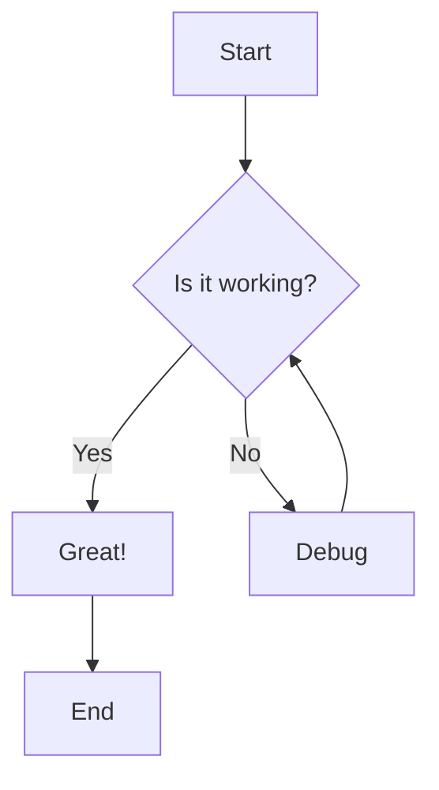
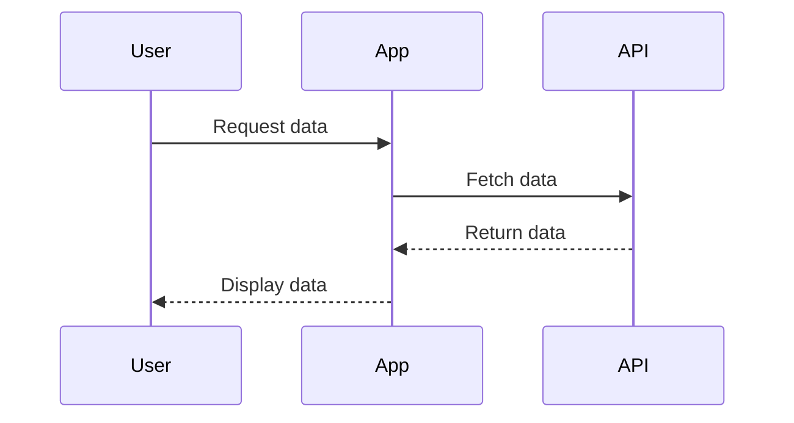

# Example Document

This is an example Markdown document with Mermaid diagrams.

## Flowchart Example



## Sequence Diagram Example



## Features

- **Bold text**
- *Italic text*
- `Inline code`

### Code Block

```javascript
function hello() {
    console.log('Hello, World!');
}
```

### Table

| Feature | Status |
|---------|--------|
| Mermaid | ✅ |
| Tables  | ✅ |
| Code    | ✅ |

### Blockquote

> This is a blockquote example.
> It can span multiple lines.

---

That's all folks!
